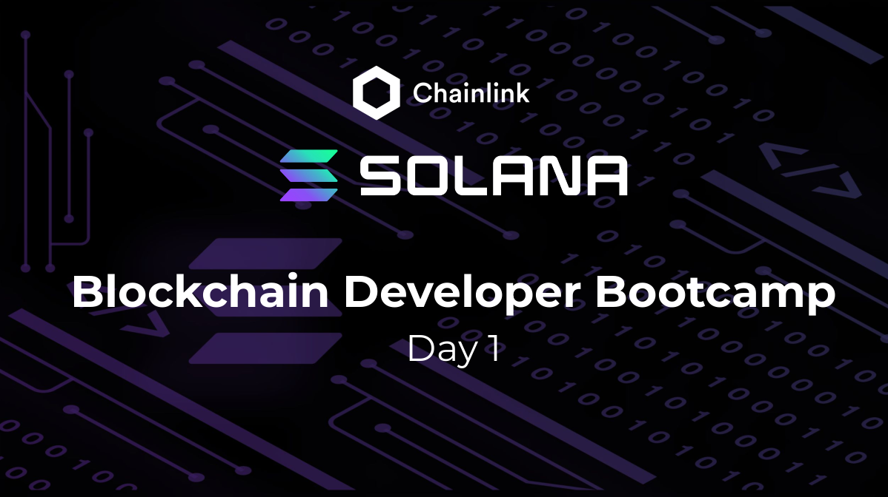

# Chainlink Solana Blockchain Developer Bootcamp 2022

 

This repo contains my code for the [Solana Blockchain Developer Bootcamp 2022](https://chain.link/bootcamp/solana-2022-on-demand) by [Chainlink](https://chain.link/)

 

This bootcamp spanned over two days. I was first introduced to the specificity of [Solana](https://chain.link/)'s architecture and programming model.
I then wrote my first ever [Rust](https://prev.rust-lang.org/en-US/) program through a [GM project](https://github.com/Niceural/solana-blockchain-developer-bootcamp/tree/main/day1/gm-program). This project taught me Rust's fundamentals.
Day 1 finished off by coding a [Token program](https://github.com/Niceural/solana-blockchain-developer-bootcamp/tree/main/day1/token-program).

 

In day 2, I familiarized myself with the [Anchor](https://docs.rs/anchor-lang/latest/anchor_lang/) framework by coding a [GM program](https://github.com/Niceural/solana-blockchain-developer-bootcamp/tree/main/day2/gm-anchor).
I then dived more deeply into developing with Solana and coded a basic [Social program](https://github.com/Niceural/solana-blockchain-developer-bootcamp/tree/main/day2/solana-social) where an account could create and update posts.
Last but not least, I had the chance to use Chainlink [Data Feeds](https://docs.chain.link/solana/) in a Solana program.

 

I would first like to thank Chainlink for this great opportunity. Biggest thanks go to [Harry Papacharissiou](https://www.linkedin.com/in/harry-papacharissiou) for putting this bootcamp together and giving us the opportunity to chew glass all together :laughing: :heart_eyes: !

 

Looking forward to develop more on Solana :star_struck: !
